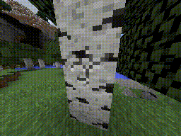
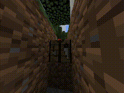
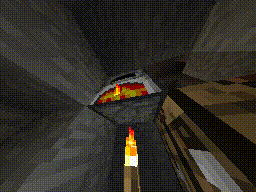
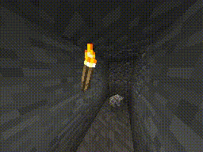
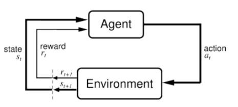
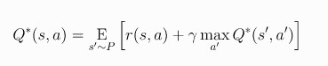
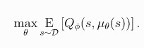
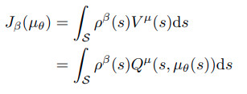
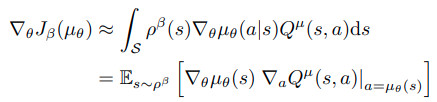

# NeurIPS 2019 : MineRL Competition

A committee of experts from RL field organized a competition using Minecraft environment for sample efficient reinforcement learning. Competition is held as part of NeurIPS 2019 event and winners will demonstrate their results during the conference. 

Although deep reinforcement learning has led to breakthroughs in many difficult domains, these successes have required an ever-increasing number of samples. Many of these systems cannot be applied to real-world problems, where environment samples are expensive. Resolution of these limitations requires new, sample-efficient methods.

This competition is designed to foster the development of algorithms which can drastically reduce the number of samples needed to solve complex, hierarchical, and sparse environments using human demonstrations. Participants compete to develop systems which solve a hard task in Minecraft, obtaining a diamond, with a limited number of samples.

This repository of code attempts to solve the problem by using Deep Deterministic Policy Gradient  (DDPG) method to estimate the agent policy in coordination with Recurrent Layers to estimate the agent state.

## Why Minecraft?

Minecraft is a rich environment in which to perform learning: it is an open-world environment, has sparse rewards, and has many innate task hierarchies and subgoals. Furthermore, it encompasses many of the problems that we must solve as we move towards more general AI (for example, what is the reward structure of “building a house”?). Besides all this, Minecraft has more than 90 million monthly active users, making it a good environment on which to collect a large-scale dataset.

## Environment Details

Minecraft is a rich environment in which to perform learning: it is an open-world environment, has sparse rewards, and has many innate task hierarchies and subgoals. Furthermore, it encompasses many of the problems that we must solve as we move towards more general AI (for example, what is the reward structure of “building a house”?). Besides all this, Minecraft has more than 90 million monthly active users, making it a good environment on which to collect a large-scale dataset.

 | 

 | 

*Some of the stages of obtaining a diamond: obtaining wood, a stone pickaxe, iron, and diamond*

During an episode the agent is rewarded only once per item the first time it obtains that item in the requisite item hierarchy for obtaining an iron pickaxe.  The **Rewards** for each item are;

> reward="1" type="log"  
> reward="2" type="planks"  
> reward="4" type="stick" 			
> reward="4" type="crafting_table"  
> reward="8" type="wooden_pickaxe"  	
> reward="16" type="cobblestone"  
> reward="32" type="furnace"  			
> reward="32" type="stone_pickaxe"  
> reward="64" type="iron_ore"  			
> reward="128" type="iron_ingot"  
> reward="256" type="iron_pickaxe"  	
> reward="1024" type="diamond"  

**Observation** of the agent consists of “equipped_items” currently in the hands of the agent, “inventory” of items the agent acquired during the game and “pov” an RGB image observation of the agent’s first-person perspective.

<code>Dict({  
&nbsp;&nbsp;"equipped_items":{  
&nbsp;&nbsp;&nbsp;&nbsp;"mainhand":{  
&nbsp;&nbsp;&nbsp;&nbsp;&nbsp;&nbsp;"damage": "Box()",  
&nbsp;&nbsp;&nbsp;&nbsp;&nbsp;&nbsp;"maxDamage": "Box()",  
&nbsp;&nbsp;&nbsp;&nbsp;&nbsp;&nbsp;"type": "Enum(none,air,wooden_axe,wooden_pickaxe,stone_axe,stone_pickaxe,iron_axe,iron_pickaxe,other)"  
&nbsp;&nbsp;&nbsp;&nbsp;}  
&nbsp;&nbsp;}  
&nbsp;&nbsp;"inventory":{  
&nbsp;&nbsp;&nbsp;&nbsp;"coal": "Box()",  
&nbsp;&nbsp;&nbsp;&nbsp;"cobblestone": "Box()",  
&nbsp;&nbsp;&nbsp;&nbsp;"crafting_table": "Box()",  
&nbsp;&nbsp;&nbsp;&nbsp;"dirt": "Box()",  
&nbsp;&nbsp;&nbsp;&nbsp;"furnace": "Box()",  
&nbsp;&nbsp;&nbsp;&nbsp;"iron_axe": "Box()",  
&nbsp;&nbsp;&nbsp;&nbsp;"iron_ingot": "Box()",  
&nbsp;&nbsp;&nbsp;&nbsp;"iron_ore": "Box()",  
&nbsp;&nbsp;&nbsp;&nbsp;"iron_pickaxe": "Box()",  
&nbsp;&nbsp;&nbsp;&nbsp;"log": "Box()",  
&nbsp;&nbsp;&nbsp;&nbsp;"planks": "Box()",  
&nbsp;&nbsp;&nbsp;&nbsp;"stick": "Box()",  
&nbsp;&nbsp;&nbsp;&nbsp;"stone": "Box()",  
&nbsp;&nbsp;&nbsp;&nbsp;"stone_axe": "Box()",  
&nbsp;&nbsp;&nbsp;&nbsp;"stone_pickaxe": "Box()",  
&nbsp;&nbsp;&nbsp;&nbsp;"torch": "Box()",  
&nbsp;&nbsp;&nbsp;&nbsp;"wooden_axe": "Box()",  
&nbsp;&nbsp;&nbsp;&nbsp;"wooden_pickaxe": "Box()"  
&nbsp;&nbsp;},  
&nbsp;&nbsp;"pov": "Box(64, 64, 3)"  
})</code>

Agent has the following list of **Actions** in its action space;

>Dict({
>&nbsp;&nbsp;"attack": "Discrete(2)",  
>&nbsp;&nbsp;"back": "Discrete(2)",  
>&nbsp;&nbsp;"camera": "Box(2,)",  
>&nbsp;&nbsp;"craft": "Enum(none,torch,stick,planks,crafting_table)",  
>&nbsp;&nbsp;"equip": "Enum(none,air,wooden_axe,wooden_pickaxe,stone_axe,stone_pickaxe,iron_axe,iron_pickaxe)",  
>&nbsp;&nbsp;"forward": "Discrete(2)",  
>&nbsp;&nbsp;"jump": "Discrete(2)",  
>&nbsp;&nbsp;"left": "Discrete(2)",  
>&nbsp;&nbsp;"nearbyCraft": "Enum(none,wooden_axe,wooden_pickaxe,stone_axe,stone_pickaxe,iron_axe,iron_pickaxe,furnace)",  
>&nbsp;&nbsp;"nearbySmelt": "Enum(none,iron_ingot,coal)",  
>&nbsp;&nbsp;"place": "Enum(none,dirt,stone,cobblestone,crafting_table,furnace,torch)",  
>&nbsp;&nbsp;"right": "Discrete(2)",  
>&nbsp;&nbsp;"sneak": "Discrete(2)",  
>&nbsp;&nbsp;"sprint": "Discrete(2)"  
>})

For more details on the environment, observation and action space click here

## Deep Deterministic Policy Gradient (DDPG) 

Agent state in Minecraft environment depends on sequence of actions it takes while the action depends on the Agent's policy which Agent needs to learn through trial and error. One of the recent algorithms to learn Agent policy is called Deep Deterministic Policy Gradient (DDPG). DDPG uses actor-critic method in which there are deep neural nets to estimate the action to be taken(actor) and to estimate the action-state value of the Agent(critic). 

Through iterative process of action-state value prediction, action prediction and taking the predicted action in the environment along with rewards from the environment, the agent tries to learn the actor-critic nets. Iterative process provides the Agent with an increasing inventory of {State, Action, Reward, Next_State} quadruples with which learning happens off-policy while the Agent keeps interacting in the environment. Off-policy means, during learning, Agent uses previous quadruples of {State, Action, Reward, Next_State} which is obtained under different policy while acting with the most recent policy in the environment. In addition, inventory of {State, Action, Reward, Next_State} is called Replay Buffer which is one of the tricks employed by DDPG algorithm to make it converge. The Agent stores all past experiences, shuffles them to remove correlations in the training data and applies DDPG algorithm to update it's actor-critic network parameters.

### Learning the Critic Network - The Q Learning Side of DDPG

Learning the critic network is closely related to the Q-Learning, another algorithm for learning  state-action values for dicrete state-action space. Both critic network and Q-Learning make use of Bellman Equations of Optimality as follows;

where s' ~~ P is shorthand for saying that the next state, s', is sampled by the environment from a distribution P(.| s,a). This Bellman equation is the starting point for learning an approximator to Q*(s,a). Suppose the approximator is a neural network Q&#934;(s,a), with parameters &#934;, and that we have collected a set of transitions (s,a,r,s',d) (where d indicates whether state s' is terminal). We can set up a mean-squared Bellman error (MSBE) function, which tells us roughly how closely Q&#934;(s,a) comes to satisfying the Bellman equation:

Here, in evaluating (1-d), we’ve used a Python convention of evaluating True to one and False to zero. Thus, when d==True — which is to say, when s' is a terminal state — the Q-function should show that the agent gets no additional rewards after the current state. (This choice of notation corresponds to what we later implement in code.)

### Learning the Actor Network - The Policy Learning Side of DDPG

Policy learning in DDPG is fairly simple. We want to learn a deterministic policy &#956;&#952;(s) which gives the action that maximizes Q&#934;(s,a). Because the action space is continuous, and we assume the Q-function is differentiable with respect to action, we can just perform gradient ascent (with respect to policy parameters &#952; only) to solve

In other words, performance objective for the policy is chosen as the value function of the target policy, averaged over the state distribution of the behaviour policy

## References

1. https://www.aicrowd.com/challenges/neurips-2019-minerl-competition#competition-structure
2. http://minerl.io/docs/environments/index.html
3. https://spinningup.openai.com/en/latest/algorithms/ddpg.html
4. Determinitic Policy Gradient Algorithms http://proceedings.mlr.press/v32/silver14.pdf